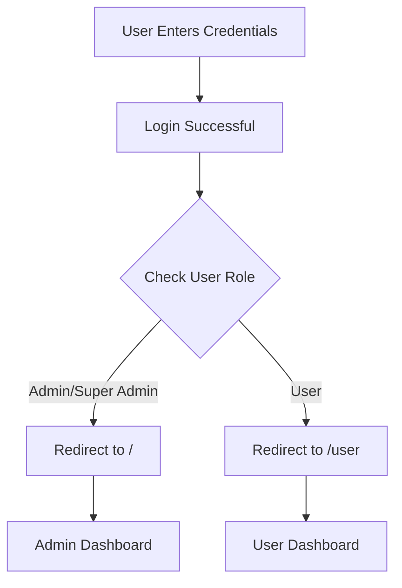
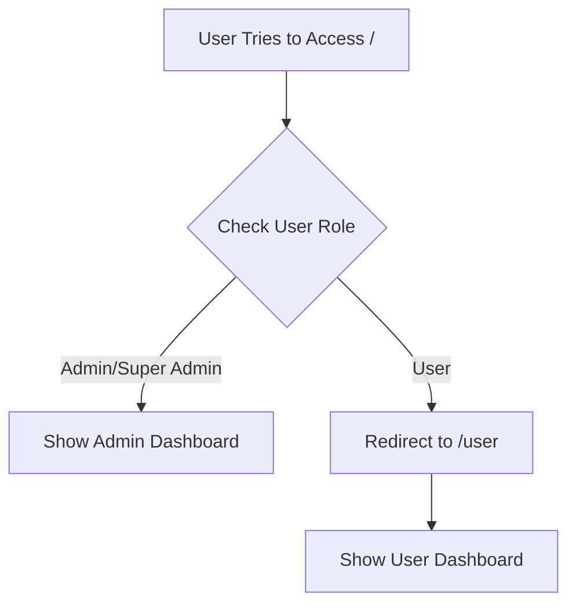

# Role-Based Dashboard Routing - Quick Guide

## What's New

✅ **Separate Dashboards**:
- **Admin Dashboard** (`/`) - For admins and super admins only
- **User Dashboard** (`/user`) - For regular users

✅ **Automatic Redirects**:
- Users trying to access `/` → Redirected to `/user`
- Login redirect based on role:
  - Admins → `/`
  - Users → `/user`

---

## Files Modified

### [src/app/user/page.tsx](file:///Users/sourav/SIB/SIBB2b/src/app/user/page.tsx) - NEW
User dashboard with:
- Welcome message with user's name
- Profile information (email, full name, role, user ID)
- Activity information (account created, last sign in, status)
- Quick stats cards (account type, security, status)
- Sign out button
- Premium UI matching admin dashboard

### [src/app/page.tsx](file:///Users/sourav/SIB/SIBB2b/src/app/page.tsx#L32-L35) - MODIFIED
Added role check:
```typescript
// Redirect regular users to user dashboard
if (currentUserProfile?.role === 'user') {
  redirect('/user');
}
```

### [src/app/login/page.tsx](file:///Users/sourav/SIB/SIBB2b/src/app/login/page.tsx#L34-L46) - MODIFIED
Added role-based redirect after login:
```typescript
// Get user's role to determine redirect
const { data: profile } = await supabase
  .from('user_profiles')
  .select('role')
  .eq('id', data.user.id)
  .single();

// Redirect based on role
if (profile?.role === 'admin' || !profile) {
  router.push('/');
} else {
  router.push('/user');
}
```

---

## How It Works

### Login Flow



### Access Control



---

## Testing Guide

### Test 1: Login as Admin
1. **Login** with admin credentials (e.g., `studyinbengalurub2b@gmail.com`)
2. **Expected**: Redirected to `/` (admin dashboard)
3. **Verify**: Can see user management section

### Test 2: Login as User
1. **Login** with user credentials
2. **Expected**: Redirected to `/user` (user dashboard)
3. **Verify**: See user profile and activity information

### Test 3: User Tries to Access Admin Panel
1. **Login** as a user
2. **Manually navigate** to `http://localhost:3000/`
3. **Expected**: Automatically redirected to `/user`
4. **Verify**: Cannot access admin dashboard

### Test 4: Admin Can Access User Dashboard
1. **Login** as admin
2. **Navigate** to `http://localhost:3000/user`
3. **Expected**: Can view user dashboard
4. **Verify**: Shows admin's profile information

---

## User Dashboard Features

### Profile Section
- **Email**: User's email address
- **Full Name**: If provided during creation
- **Role**: User role badge (blue)
- **User ID**: Unique identifier

### Activity Section
- **Account Created**: Registration date
- **Last Sign In**: Most recent login time
- **Account Status**: Active/Inactive indicator

### Quick Stats
- **Account Type**: Standard User
- **Security**: Protected status
- **Status**: Online indicator

---

## Security

✅ **Server-Side Protection**:
- Role check happens on the server
- Users cannot bypass by manipulating client-side code
- Automatic redirect before page renders

✅ **Consistent Experience**:
- Same premium UI design across both dashboards
- Smooth transitions and animations
- Responsive layout

---

## Quick Reference

| User Role | Login Redirect | Can Access `/` | Can Access `/user` |
|-----------|---------------|----------------|-------------------|
| Super Admin | `/` | ✅ Yes | ✅ Yes |
| Admin | `/` | ✅ Yes | ✅ Yes |
| User | `/user` | ❌ No (redirected) | ✅ Yes |

---

## Next Steps (Optional Enhancements)

1. **User Profile Editing**: Allow users to update their profile
2. **Password Change**: Let users change their password
3. **Activity Log**: Show user's login history
4. **Notifications**: Add notification system
5. **Settings**: User preferences and settings page
